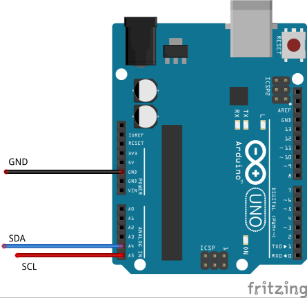

# DuinoBoX - An Xbox EEPROM Reader
DuinoBoX is an Xbox EEPROM Reader for helping Original Xbox owners recover the EEPROM from their console. It makes use of the Arduino and its SPI and Serial comminucation capabilities. 

The Arduino sketch extracts the data from the Xbox's 256 byte EEPROM and either stores the data in the Arduino's EEPROM, or transmits the data to a computer via the Arduino's serial connection over USB.

## Features
* **Remote EEPROM Extraction:** Arduino will store the Xbox's EEPROM onto it's own internal EEPROM if it's not connected to a computers via the USB port.

## How to Use

### Preparing the Arduino board
Open the included Arduino sketch `duinobox-sketch.ino` located in the `duinobox-sketch` directory with the [Arduino IDE](https://www.arduino.cc/en/Main/Software), then upload it onto the Arduino Uno board.

#### Using Remote EEPROM Extraction
When the Arduino is not connected to a computer, it will try to detect and read the Xbox's EEPROM. If successful the Arduino will store the EEPROM data on the Arduino's internal EEPROM storage.

When the Arduino is connected to a computer and the Arduino cannot detect the Xbox's EEPROM, it will retrieve the saved EEPROM data  and send it to the computer.

If a computer and the Xbox's EEPROM are connected, the Arduino will read the EEPROM and directly send the data to the computer.

### Getting the DuinoBoX EEPROM Reader Program
Binary releases can be found under the [releases page.](https://github.com/ExtraordinaryBen/DuinoBoX/releases)

## Building From Source
DuinoBoX is coded in C++ and Qt5.6 (or higher.) Simply open the project in QtCreator and build. (Or use qmake.)

## TODO
* Decrypt HDD Key (Maybe? Other tools like Chimp already handle this.)

## Authors
Ben DeCamp (ExtraordinaryBen) -- Inital work

## License
DuinoBoX is released under the GPLv3 License. See the 'LICENSE' file for details.

## Acknowledgements
[Fritzing](http://fritzing.org/home/) -- Thanks to Fritzing for their excellent diagram software. (Used to create the Arduino wiring diagram.)

